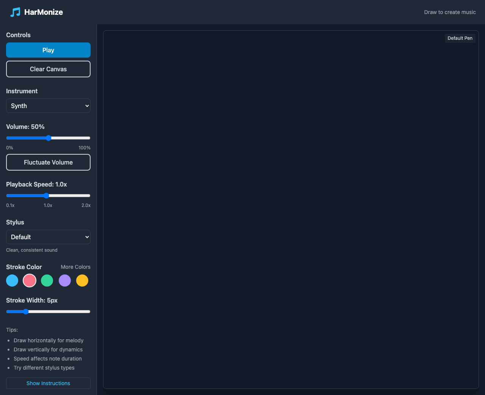

# HarMonize - Draw Music in Your Browser

HarMonize is an interactive web application that lets you create music through drawing. As you draw shapes on the canvas, they are transformed into musical notes and patterns in real-time.

**Live demo:** _redeploying — run locally via the steps below_



## Features

- Draw shapes that transform into musical patterns
- Choose different instruments and sound settings
- Adjustable stroke width and color
- Simple, intuitive interface
- Audio permissions handler for a better user experience

## No Server Required!

This is a completely client-side application with no backend. To use it:

1. Simply open the `public/index.html` file in your web browser
   - Double-click the file
   - Or drag it into your browser window

## Recent Updates

### 🔊 Audio Improvements
- Added a dedicated AudioInitializer component that helps users enable sound with a single click
- Fixed issues with audio stopping after extended use
- Improved error handling and resource management
- Better browser compatibility with audio context permissions

### 🚀 Vercel Deployment
- Project now configured for easy deployment to Vercel
- Added appropriate build scripts and configuration files

## Development

If you want to make changes to the source code:

1. Clone the repository
2. Run `npm install` to install dependencies
3. Run `npm run dev` to start the development server
4. Make your changes in the `src` directory
5. Run `npm run build` to build for production

## How It Works

HarMonize uses:
- React for the UI components
- Tone.js for sound generation
- A direct linear mapping to transform drawn strokes into musical parameters — X position to pitch, Y position to loudness, and stroke speed to note duration (no FFT/Fourier analysis is performed)
- TailwindCSS for styling

The application is completely static - all processing happens in your browser with no server required.

## 🖌️ What You Can Do

- Draw on a canvas to generate music in real-time
- Hear melodies and rhythms shaped by your visual gestures
- Change drawing parameters like stroke color or sound instrument
- Play or replay your generated composition
- Works offline — no internet required after load

## 🧱 Project Structure

```
/public               # Static assets and compiled output
  └── index.html     # Entry point
/src
├── App.tsx          # Main React component
├── components/
│   ├── AudioInitializer.tsx  # Component to handle audio permissions
│   ├── Canvas.tsx            # Drawing interface + stroke data tracking
│   ├── Toolbar.tsx           # UI controls: clear, play, options
│   └── SoundEngine.ts        # Audio generation using Tone.js
├── hooks/
│   └── useCanvas.ts         # Custom hook for drawing logic
├── utils/
│   └── mapDrawingToSound.ts # Translates drawing data to musical parameters
├── main.tsx                 # Renders the app
└── index.css                # Tailwind CSS imports
```

## 🔊 How It Works

### 🎨 Canvas Input
- Tracks strokes as a series of points: { x, y, time }
- Supports mouse and touch input
- Optionally adds stroke velocity or pressure (with pointer events)

### 🎵 Sound Mapping
- X position → pitch
- Y position → dynamics or filter
- Stroke speed → note duration or rhythm
- Each stroke = a melodic or rhythmic phrase
- Mapped notes are played live or queued for replay

### 🔈 Audio Playback
- Built on the Web Audio API via Tone.js
- Synths triggered based on the interpreted stroke data
- Modular: easily swap out synths, scales, or effects
- Automatic resource cleanup to prevent audio issues

```typescript
synth.triggerAttackRelease("C4", "8n", Tone.now());
```

## 🧰 Tools & Libraries

All frontend:

| Tool | Purpose |
| ---- | ------- |
| React | UI components |
| TypeScript | Type-safe logic |
| Tailwind CSS | Utility-first responsive UI |
| Tone.js | Audio synthesis and sequencing |
| Webpack | Module bundling |

## 🛠 Getting Started

### Installation

1. Clone the repository
   ```
   git clone https://github.com/CodingFreeze/Harmonize.git
   cd harmonize
   ```

2. Install dependencies
   ```
   npm install
   ```

3. Start development server
   ```
   npm run dev
   ```

4. Open browser at the URL shown in the terminal

### Building for Production

```
npm run build
```

The production-ready files will be in the `dist` directory, which you can deploy to any static host.

## Deployment

This project is configured for easy deployment to Vercel:

1. Push your code to GitHub
2. Connect your GitHub repository to Vercel
3. Vercel will automatically detect the build settings

## ⚠️ Browser Notes

- Audio autoplay policies: Sound won't start until the user interacts (click/tap)
- Touch events: Uses touchstart and touchmove for mobile
- Performance: Uses requestAnimationFrame and throttle drawing updates

## 🧠 Ideas for Expansion

- 🎚 Stroke-based instrument switch (draw slow = piano, fast = drums?)
- 🎵 Export to WAV or MIDI
- 🔁 Save and load stroke compositions from localStorage
- 🎼 Visual sheet music generator
- 🧠 ML-enhanced harmony suggestions

## 📜 License

MIT
